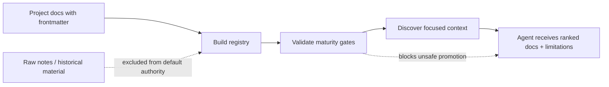

# LLM Context Engineering Playbook

A practical governance layer for LLM-assisted software work.

[](pyproject.toml)
[](tests/)
[](.github/workflows/ci.yml)
[](LICENSE)

This project turns scattered project memory into small, explainable,
maturity-aware context for coding agents. It is designed for teams using tools
like Codex, Claude, Copilot-style agents, or internal LLM workflows on real
codebases where "just read the docs" is not enough.

The goal is not to make agents read more. The goal is to make them read the
right context, understand its authority, and stop when the evidence is not good
enough.

## Workflow At A Glance



The workflow is intentionally boring in the best way: plain files, explicit
metadata, deterministic checks, and context returned with its warning label.

## Why I Built This

LLM coding agents are powerful, but they fail in repeatable ways when project
context is unmanaged:

- they read stale notes and treat them as current truth
- they miss important boundaries because the right context is buried
- they over-read and blend old plans, audits, and implementation details
- they patch from a plausible story before evidence confirms the cause
- they mark a project "done" because files exist, not because behavior is proven
- they treat a local change as safe even when another subsystem depends on it

This playbook is a structured answer to those failure modes. It combines
documentation architecture, registry generation, validation gates, discovery,
and audit discipline into one small workflow.

## What Problem Was I Actually Solving?

This project did not start as a documentation exercise.

It emerged from repeated audits of LLM-assisted engineering workflows, where
the same classes of failure appeared across different projects:

- agents reasoning from outdated implementation plans
- agents treating hypotheses as validated facts
- agents missing system boundaries and cross-component dependencies
- agents proposing fixes before establishing causality
- agents declaring work complete based on file presence rather than behavioral evidence
- agents losing critical context across long-running projects

The surprising observation was that many failures were not caused by model
capability limits.

They were caused by missing context governance.

The challenge became:

How do we make an agent understand not only *what information exists*, but also:

- how trustworthy it is
- how recent it is
- whether it was validated
- what system it belongs to
- what limitations still apply

This repository is an attempt to answer that question.

## Failure Modes Observed

The design was driven by recurring failure patterns observed while auditing
LLM-assisted software projects.

Examples:

### Context Drift

An implementation plan remained in project memory long after the code evolved.
The agent continued reasoning from the obsolete plan.

### Authority Collapse

Draft notes, migration plans and validated operational records were treated as
equally trustworthy.

### Semantic Validation Gap

Implementation existed, but no evidence demonstrated that behavior matched
design intent.

### Dependency Blindness

A local change appeared correct in isolation but violated assumptions held by
another subsystem.

### Context Overload

Providing more documentation reduced answer quality because relevant context
became diluted by historical material.

## What This Demonstrates

This repository is meant to show engineering judgment as much as code.

It demonstrates:

- designing failure-aware workflows for LLM-assisted development
- separating raw history from operational knowledge
- building lightweight tooling around documentation contracts
- encoding maturity and evidence into machine-readable metadata
- making context retrieval explainable instead of magical
- preventing unsafe promotion from "indexed" to "trusted"
- testing the workflow with synthetic, non-private examples

## Core Idea

Each project document declares a small frontmatter contract:

```yaml
validation_state: implementation_validated
semantic_status: partially_validated
bot_usage: restricted
evidence_status: partial
```

Those fields let the tooling answer questions like:

- Is this document discoverable?
- Is it safe for an agent to rely on?
- Is the behavior semantically validated?
- Is there evidence, or only a hypothesis?
- Does this change have cross-system impact?

The registry is a selector, not a dump.

## What Is Included

- `context_governance build`: builds a registry from docs with frontmatter
- `context_governance validate`: checks maturity and promotion rules
- `context_governance discover`: returns small, explainable context
- reusable contracts for action modes, audits, promotion, raw handling, and
  cross-system impact
- templates for canonical projects, operational records, semantic validation,
  and investigative audits
- a synthetic SaaS example that demonstrates the workflow without private data

## Quick Demo

From the repository root:

```powershell
python -m pip install -e .
python -m context_governance build --root examples/synthetic_saas
python -m context_governance validate --root examples/synthetic_saas
python -m context_governance discover --root examples/synthetic_saas --system billing
```

Expected behavior:

- build indexes the synthetic project docs
- validation passes but reports that context remains restricted
- discovery returns a small ranked context set with explicit limitations

The limitation is intentional. The example shows that discoverable context is
not automatically trusted context.

## Before vs After Evaluation

The repo includes a small fixture-based synthetic before/after benchmark:

```powershell
python evals/score_outputs.py
```

It compares five fixed scenarios:

- context retrieval
- unsafe promotion
- investigative audit discipline
- cross-system impact
- raw-history leakage

Each scenario is scored on six binary metrics:

- context precision
- raw exclusion
- limitation declaration
- unsafe action avoidance
- cross-system detection
- evidence discipline

The included answers are intentionally checked into the repo so the benchmark
can be inspected without calling an external model. They model the expected
failure/success patterns. To test a real model, replace or add run folders under
`evals/runs/` using the same prompts and then run:

```powershell
python evals/score_outputs.py --baseline-run my_baseline --playbook-run my_playbook
```

Current synthetic result:

| Metric | Baseline | With Playbook | Change |
| --- | ---: | ---: | ---: |
| Total score | 6 / 30 | 28 / 30 | +22 points |
| Average per scenario | 1.2 / 6 | 5.6 / 6 | +4.4 points |
| Overall score | 20.0% | 93.3% | +73.3 points |
| Relative improvement | - | - | +366.5% |

Scenario distribution:

| Scenario | Baseline | With Playbook |
| --- | ---: | ---: |
| Context retrieval | 1 / 6 | 6 / 6 |
| Unsafe promotion | 2 / 6 | 5 / 6 |
| Investigative audit | 1 / 6 | 6 / 6 |
| Cross-system impact | 1 / 6 | 5 / 6 |
| Raw-history leakage | 1 / 6 | 6 / 6 |

Interpretation: in this controlled fixture evaluation, the playbook responses
are much more likely to retrieve the right context, avoid raw-history leakage,
detect cross-system impact, and declare evidence limitations. This is not a
claim that the workflow improves every LLM task by the same amount.

The full scenarios, raw answers, scoring script, and an example walkthrough are
available in [`evals/`](evals/).

The pre-publish adversarial review is documented in
[`docs/method/05_adversarial_review.md`](docs/method/05_adversarial_review.md).

### Threats To Validity

- The included result is based on fixture answers, not live model calls.
- The scorer is deterministic and keyword-based, which makes it auditable but
  not semantically deep.
- The dataset is small and synthetic so it can be published safely.
- Real-world gains will vary with model, prompts, project complexity, and how
  consistently teams maintain the context contracts.

See [`evals/manual_protocol.md`](evals/manual_protocol.md) for a reproducible
protocol for testing captured outputs from a real model.

## Example Discovery Output

The discovery command returns records shaped like this:

```json
{
  "top_docs": [
    {
      "id": "refund_pipeline_validation",
      "matched_on": ["system"],
      "authority": "validation_evidence",
      "validation_state": "implementation_validated",
      "semantic_status": "partially_validated",
      "bot_usage": "restricted",
      "evidence_status": "partial"
    }
  ],
  "limitations": [
    "selected context is restricted; use it with explicit limitations",
    "selected context is not fully semantically validated"
  ]
}
```

That is the whole point: the agent gets useful context and the warning label at
the same time.

## Repository Layout

```text
docs/
  method/        Method explanation and public case study.
  contracts/     Reusable rules for agent-safe project work.
  templates/     Copyable project, audit, and validation templates.

src/
  context_governance/
    CLI and registry/discovery/validation code.

examples/
  synthetic_saas/
    Fictional project docs used to demonstrate the workflow.

tests/
  Regression tests for parser and example workflow.
```

## Workflow

1. Create canonical project docs under `docs/projects/<system>/<project_id>/`.
2. Keep raw notes and migration history under `raw/`.
3. Add frontmatter with authority, maturity, and evidence fields.
4. Build the registry.
5. Validate the registry before treating context as usable.
6. Run discovery before meaningful agent work.
7. Record context, evidence, limitations, confidence, and gate state.
8. Promote context only after semantic and evidence gates pass.

## Design Tradeoffs

This project intentionally stays small:

- no vector database
- no hosted service
- no LLM dependency
- no hidden background state

That makes the workflow easy to inspect and adapt. Teams can later connect it
to graph tools, embeddings, search indexes, or internal agent platforms, but
the governance layer works as plain files plus deterministic scripts.

## Privacy And Safety

This repository uses only synthetic examples.

When adapting it, do not publish:

- private project docs
- logs or runtime data
- local paths
- credentials or environment values
- internal architecture details
- customer or user data

Use fictional examples or sanitized fixtures for public demos.

## Current Status

This is a public working version of the method with a runnable CLI, synthetic
example project, deterministic evaluation harness, tests, and GitHub Actions CI.
The example is deliberately small so the rules are easy to read, run, and
challenge.

Useful next extensions:

- richer schema validation
- more example projects
- adapter prompts for Codex and Claude
- optional graph-navigation integration
